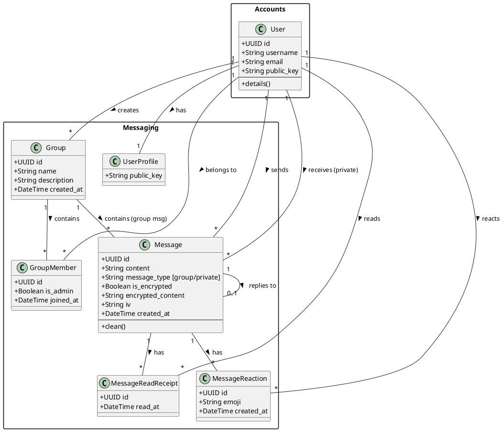
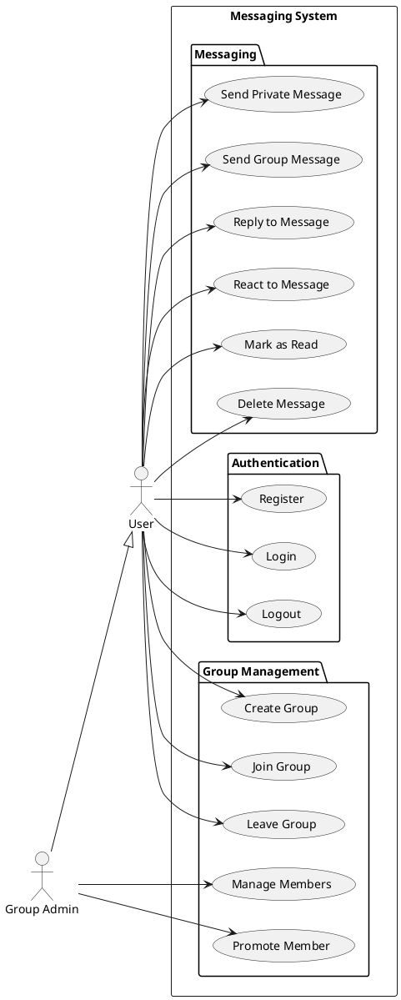
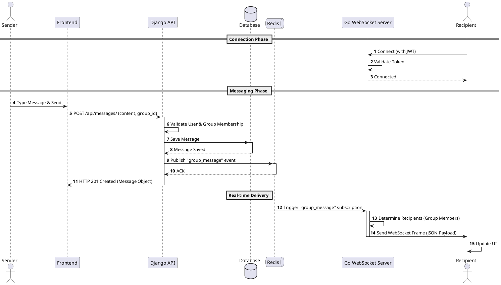
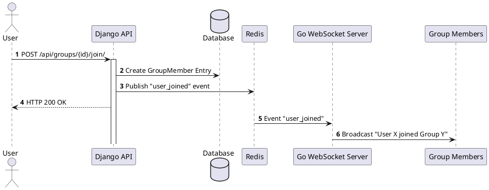

# Distributed Messaging System - Backend Documentation

This document provides a deep technical overview of the Distributed Messaging System backend, which utilizes a hybrid architecture combining **Django** for RESTful APIs and business logic with a **Go** WebSocket server for high-performance real-time communication.

## 1. System Architecture

The system follows a microservices-like hybrid approach:

*   **Django Backend (Port 8000)**: Serves as the primary source of truth, handling user authentication, database interactions (SQLite/PostgreSQL), and REST API endpoints. It publishes real-time events to Redis.
*   **Go WebSocket Server (Port 8080)**: Handles persistent WebSocket connections. It subscribes to Redis channels to receive events from Django and broadcasts them to connected clients.
*   **Redis**: Acts as the message broker (Pub/Sub) bridging the Django application and the Go WebSocket server.
*   **Frontend**: Interacts with Django via HTTP (REST) and the Go server via WebSocket.

### Architecture Flow
1.  **Auth**: User authenticates with Django, receiving a JWT.
2.  **Connection**: User connects to Go WebSocket server using the JWT.
3.  **Action**: User performs an action (e.g., Send Message) via Django REST API.
4.  **Persistence**: Django saves data to the database.
5.  **Event**: Django publishes an event to Redis (e.g., `group_message`).
6.  **Broadcast**: Go server receives the event and pushes it to relevant WebSocket clients.

---

## 2. Technology Stack

*   **Language**: Python 3.x (Django), Go (1.20+)
*   **Frameworks**: 
    *   Django & Django REST Framework (DRF)
    *   Gorilla WebSocket (Go)
*   **Database**: SQLite (Development)
*   **Message Broker**: Redis
*   **Authentication**: JWT (SimpleJWT)
*   **Documentation Tools**: Swagger/OpenAPI (drf-spectacular), PlantUML

---

## 3. Database Schema & Data Models

The core data models are defined in the Django backend.

### PlantUML Class Diagram
The following diagram illustrates the relationships between Users, Groups, Messages, and Reactions.



---

## 4. System Capabilities (Use Cases)

The system supports granular roles (User, Admin) and various messaging capabilities including encryption and reactions.

### PlantUML Use Case Diagram



---

## 5. Sequence Diagrams

### 5.1 Real-time Group Message Flow
This scenario depicts the lifecycle of a message from the moment a user sends it until it is received by other group members in real-time.



### 5.2 User Join & Notification Flow



---

## 6. API Reference Overview

### Accounts
| Method | Endpoint | Description |
| :--- | :--- | :--- |
| `POST` | `/api/auth/login/` | Obtain JWT access/refresh tokens |
| `POST` | `/api/auth/register/` | Register a new user account |
| `GET` | `/api/users/me/` | Get current user profile |

### Messaging
| Method | Endpoint | Description |
| :--- | :--- | :--- |
| `GET` | `/api/groups/` | List all groups |
| `POST` | `/api/groups/` | Create a new group |
| `POST` | `/api/groups/{id}/join/` | Join a specific group |
| `POST` | `/api/groups/{id}/leave/` | Leave a group |
| `GET` | `/api/messages/?group={id}` | Get distinct messages for a group |
| `GET` | `/api/messages/?recipient={id}`| Get private conversation history |
| `POST` | `/api/messages/` | Send a new message (Group or Private) |
| `POST` | `/api/messages/mark_read/` | Batch mark messages as read |
| `POST` | `/api/messages/{id}/react/` | Add/Toggle an emoji reaction |

---

## 7. Real-time Event Types
The Go server handles the following event types broadcasted via Redis:

*   `group_message`: New message in a group.
*   `private_message`: New direct message.
*   `user_joined`: A user joined a group.
*   `user_left`: A user left a group.
*   `user_removed`: A user was kicked from a group.
*   `member_promoted`: A member was promoted to admin.
*   `message_deleted`: A message was deleted.
*   `message_read`: A read receipt was generated.
*   `typing_indicator`: (Planned) User is typing.

---

## 8. Setup Instructions

To get the Distributed Messaging System up and running locally, follow these steps.

### Prerequisites
*   **Python 3.10+** (for Django)
*   **Go 1.21+** (for WebSocket server)
*   **Redis 6.0+** (Message Broker)
*   **SQLite** (Default DB) or **PostgreSQL**
*   **Node.js/npm** (Frontend serving)

### 8.1. Django Backend Setup
1.  **Navigate to the project root:**
    ```bash
    cd distributed-messaging
    ```
2.  **Create and activate a virtual environment:**
    ```bash
    python -m venv venv
    source venv/bin/activate  # On Windows: venv\Scripts\activate
    ```
3.  **Install Python dependencies:**
    ```bash
    pip install -r requirements.txt
    ```
4.  **Configure Environment:**
    *   Copy `.env.example` to `.env` (if not already present).
    *   Ensure `REDIS_URL` matches your local Redis instance (default: `redis://127.0.0.1:6379/1`).
5.  **Run Migrations:**
    ```bash
    python manage.py migrate
    ```
6.  **Create a Superuser (Optional):**
    ```bash
    python manage.py createsuperuser
    ```
7.  **Run the Server:**
    ```bash
    python manage.py runserver 8000
    ```
    The API will be available at `http://localhost:8000/api/`.

### 8.2. Go WebSocket Server Setup
1.  **Navigate to the WebSocket directory:**
    ```bash
    cd websocket-server
    ```
2.  **Install Go dependencies:**
    ```bash
    go mod download
    ```
3.  **Configure Environment:**
    *   Copy `.env.example` to `.env`.
    *   **CRITICAL**: Ensure `JWT_SECRET` in `.env` matches the `SECRET_KEY` from your Django settings.
4.  **Run the Server:**
    ```bash
    make run
    # OR directly:
    go run main.go
    ```
    The WebSocket server will start on port `8001` (default).

### 8.3. Redis
Ensure Redis is running locally:
```bash
redis-server
```

---

## 9. System Report

### 9.1. Approach: Hybrid Architecture
This project demonstrates a rigorous "Right Tool for the Job" approach by combining two powerful backend technologies:

*   **Django (Python)**: Used for the **Control Plane**. Django excels at rapid development of complex data models, business logic, authentication, and REST APIs. It serves as the "Source of Truth" for the system.
*   **Go (Golang)**: Used for the **Data Plane (Real-time)**. Go is chosen for its superior concurrency model (goroutines) and low-latency performance, making it ideal for maintaining thousands of persistent WebSocket connections and broadcasting messages efficiently.

The system uses a **message broker (Redis)** to decouple these two components, allowing them to scale independently.

### 9.2. System Architecture Diagram

```mermaid
graph TD
    Client[Client (Browser/Mobile)]
    
    subgraph "Django Backend (Port 8000)"
        API[REST API]
        Auth[Authentication Service]
        DB[(SQL Database)]
    end
    
    subgraph "Infrastructure"
        Redis[(Redis Pub/Sub)]
    end
    
    subgraph "Go WebSocket Server (Port 8001)"
        WSS[WebSocket Handler]
        Sub[Redis Subscriber]
        Hub[Client Hub]
    end

    %% Flows
    Client -- HTTP/REST --> API
    API -- Read/Write --> DB
    API -- Publish Event --> Redis
    
    Client -- WebSocket Connection --> WSS
    WSS -- Auth Check (JWT) --> Auth
    
    Redis -- Event Push --> Sub
    Sub -- Forward Event --> Hub
    Hub -- Broadcast --> WSS
    WSS -- Push Message --> Client
```

### 9.3. Technologies Used
*   **Backend Framework**: Django 4.x / Django REST Framework
    *   *Why?* Mature ecosystem, built-in security (ORM injection protection), rapid CRUD generation.
*   **Real-time Server**: Go (Golang) with Gorilla WebSocket
    *   *Why?* High concurrency with low memory footprint per connection.
*   **Message Broker**: Redis
    *   *Why?* Extremely fast in-memory store, native Pub/Sub capabilities perfect for ephemeral measuring events.
*   **Database**: SQLite (Dev) / PostgreSQL (Prod)
    *   *Why?* Relational data integrity for users, groups, and message history.
*   **Authentication**: JSON Web Tokens (JWT)
    *   *Why?* Stateless authentication sharable between Django (Issuer) and Go (Validator).

### 9.4. Distributed Concepts Demonstrated
1.  **Event-Driven Architecture**: The system relies on events (`group_message`, `user_joined`) rather than direct coupled calls. The Django backend "fires and forgets" events to Redis, not caring who is listening.
2.  **Decoupling**: The REST API and WebSocket server are completely decoupled. You can restart the WebSocket server without affecting the API, and vice-versa (though real-time features would pause).
3.  **Statelessness (Partial)**: The Go server treats connections as ephemeral. If it crashes, clients simply reconnect. It does not store message history locally; it relies on the database (via Django) for history.
4.  **Pub/Sub Pattern**: Used for 1-to-Many broadcasting. A single message sent to the API is published once to Redis, then fanned out to multiple WebSocket clients.

### 9.5. Limitations and Future Improvements

**Current Limitations:**
*   **Single Redis Instance**: Redis is a Single Point of Failure (SPOF) for real-time features. If Redis goes down, messaging stops working (though the API remains functional).
*   **No Message Queuing**: We use Redis Pub/Sub (fire-and-forget). If the Go server is down when a message is sent, that real-time notification is lost forever (clients must fetch history from API to "catch up" upon reconnection).
*   **Go Server Scalability**: Currently, the Go server stores local connection maps. If we scale to multiple Go instances, we need a mechanism (like Redis Streams or inter-node communication) to ensure a message published to Instance A reaches a user connected to Instance B.

**Future Improvements:**
1.  **Redis Cluster**: Implement Redis Sentinel or Cluster for high availability.
2.  **Reliable Delivery**: Switch from Redis Pub/Sub to **Redis Streams** or **Kafka** to ensure at-least-once delivery of events to the WebSocket server.
3.  **Horizontal Scaling**: Modify the Go architecture to handle multi-node deployments, ensuring users on different WebSocket servers can chat with each other (requires a Redis backplane strategy).
4.  **Mobile Push Notifications**: Integrate FCM/APNS for when users are offline (WebSocket disconnected).


