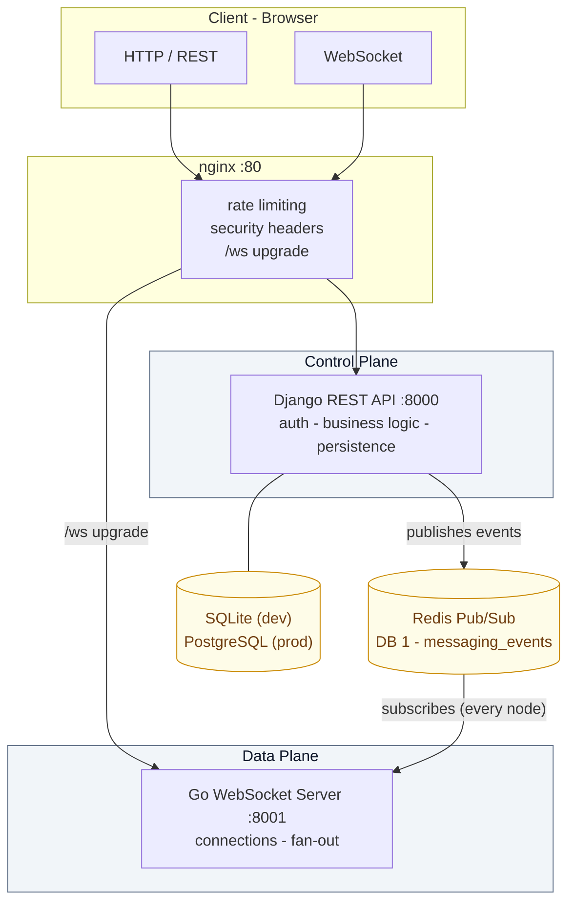
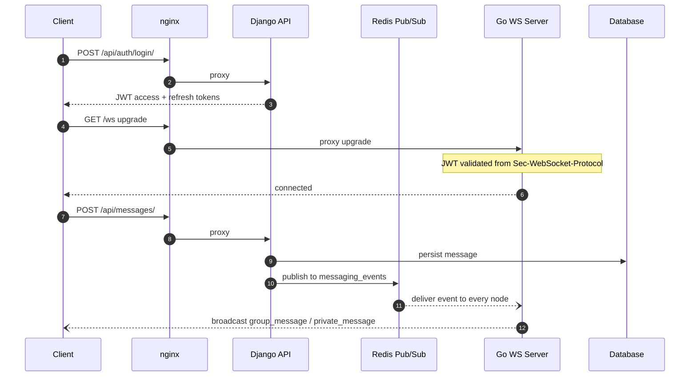

# Distributed Messaging System


A **hybrid real-time messaging platform** that combines **Django** for business logic
and RESTful APIs with a high-performance **Go WebSocket server** for real-time
communication. Designed for scalability, low latency, and clean separation of concerns.

---

## Contents

- [Features](#features)
- [Architecture](#architecture)
- [Tech Stack](#tech-stack)
- [Getting Started](#getting-started)
- [API Endpoints](#api-endpoints)
- [Real-Time Events](#real-time-events)
- [Project Structure](#project-structure)
- [Environment Variables](#environment-variables)
- [Testing](#testing)
- [Documentation](#documentation)
- [Roadmap](#roadmap)
- [License](#license)
- [Author](#author)

---

## Features

| Real-Time | Security | Platform |
|---|---|---|
| Instant delivery via WebSocket (< 10 ms target latency) | AES-256-GCM encrypted payloads with per-recipient keys | Group & private chats |
| Typing indicators and online presence | Public keys hosted per-user (*server-assisted* client encryption — keys transit the server, so not fully server-independent E2EE) | Role-based access — admins promote members & manage entry |
| Read receipts and threaded replies | JWT auth shared statelessly across Django and Go | File uploads within conversations |

---

## Architecture

A microservices-like hybrid with three core components, split into a **control plane**
(business logic + persistence) and a **data plane** (persistent connections + fan-out),
decoupled by Redis Pub/Sub.



| Component | Role |
|---|---|
| **Django Backend** | Control plane — authentication, business logic, REST APIs, database access |
| **Go WebSocket Server** | Data plane — persistent connections, low-latency message broadcasting |
| **Redis** | Message broker — decouples Django and Go via Pub/Sub |

### Message Flow



> **Scaling** — how the WebSocket tier handles many concurrent connections and
> multi-replica deployments: [docs/SCALING.md](docs/SCALING.md).
>
> **Embedding** — ship self-hosted chat inside your own app with the zero-dependency
> widget (`dms-chat.js`) or React SDK: [docs/EMBED.md](docs/EMBED.md).

---

## Tech Stack

| Layer | Technology |
|---|---|
| Backend API | Python 3.10+, Django 6.0, Django REST Framework |
| WebSocket Server | Go 1.21+, Gorilla WebSocket |
| Message Broker | Redis 6.0+ (Pub/Sub) |
| Database | SQLite (dev) / PostgreSQL (prod) |
| Authentication | JWT via SimpleJWT |
| Frontend | Vanilla JavaScript, CSS |
| API Docs | Swagger / OpenAPI (drf-spectacular) |

---

## Getting Started

Prerequisites: **Python 3.10+**, **Go 1.21+**, **Redis 6.0+**, **Git**

### 1. Clone the repository

```bash
git clone https://github.com/Kyei-Ernest/distributed-messaging.git
cd distributed-messaging
```

### 2. Start Redis

```bash
redis-server
```

### 3. Django backend

```bash
# Create & activate virtual environment
python -m venv venv
source venv/bin/activate   # Windows: venv\Scripts\activate

# Install dependencies
pip install -r requirements.txt

# Configure environment
cp .env.example .env       # edit SECRET_KEY, REDIS_URL, etc.

# Migrate & run
python manage.py migrate
python manage.py createsuperuser   # optional
python manage.py runserver 8000
```

### 4. Go WebSocket server

```bash
cd websocket-server
go mod download

cp .env.example .env       # IMPORTANT: set JWT_SECRET = Django SECRET_KEY

make run                   # or: go run main.go
```

### 5. Frontend

```bash
cd frontend
python -m http.server 5500
```

### One-command alternative

A launcher script starts all services in separate terminal tabs:

```bash
python start_servers.py          # start all servers
python start_servers.py stop     # stop all servers
python start_servers.py list     # list configured servers
```

Prefer containers? `docker compose up --build` runs the entire stack
(PostgreSQL, Redis, backend, websocket, nginx).

---

## API Endpoints

### Authentication

| Method | Endpoint | Description |
|---|---|---|
| `POST` | `/api/auth/register/` | Register a new account |
| `POST` | `/api/auth/login/` | Obtain JWT tokens |
| `GET` | `/api/users/me/` | Get current user profile |

### Messaging

| Method | Endpoint | Description |
|---|---|---|
| `GET` | `/api/groups/` | List all groups |
| `POST` | `/api/groups/` | Create a new group |
| `POST` | `/api/groups/{id}/join/` | Join a group |
| `POST` | `/api/groups/{id}/leave/` | Leave a group |
| `GET` | `/api/messages/?group={id}` | Get group messages |
| `GET` | `/api/messages/?recipient={id}` | Get private conversation |
| `POST` | `/api/messages/` | Send a message |
| `POST` | `/api/messages/mark_read/` | Batch mark as read |
| `POST` | `/api/messages/{id}/react/` | Add emoji reaction |

> Full interactive documentation lives at `/api/docs/` (Swagger UI) while the Django
> server is running.

---

## Real-Time Events

Events broadcast by the Go WebSocket server:

| Event | Description |
|---|---|
| `group_message` | New message in a group |
| `private_message` | New direct message |
| `user_joined` | User joined a group |
| `user_left` | User left a group |
| `user_removed` | User removed from group |
| `member_promoted` | Member promoted to admin |
| `message_deleted` | Message was deleted |
| `message_read` | Read receipt generated |
| `typing_indicator` | User is typing |

---

## Project Structure

<details open>
<summary><strong>Repository layout</strong></summary>

```
distributed-messaging/
├── accounts/              # Django user auth, workspaces & profiles
├── config/                # Django project settings
├── messaging/             # Groups, messages, receipts, reactions
├── frontend/              # Vanilla JS/CSS client
│   ├── index.html
│   ├── styles.css
│   ├── js/
│   │   ├── app.js            # App entry point
│   │   ├── api.js            # REST API client
│   │   ├── core/             # Event bus
│   │   ├── modules/          # Auth, Chat, Groups, Messages, Navigation, Users
│   │   ├── ui/               # UI rendering
│   │   └── features/         # Context menu, media, voice, themes, inputs
│   └── widget/
│       ├── dms-chat.js       # Zero-dependency embeddable widget
│       └── react/            # React SDK wrapper
├── websocket-server/      # Go WebSocket server
│   ├── main.go
│   ├── handlers/          # Upgrade + JWT validation
│   ├── manager/           # Connection manager
│   ├── models/            # Event models
│   ├── pubsub/            # Redis subscriber
│   └── config/            # Server configuration
├── docs/                  # SCALING.md, EMBED.md
├── docker-compose.yml     # Full-stack deployment
└── requirements.txt
```

</details>

---

## Environment Variables

Copy `.env.example` to `.env` and configure:

<details>
<summary><strong>Variable reference</strong></summary>

| Variable | Description | Default |
|---|---|---|
| `SECRET_KEY` | Django secret key (also signs WebSocket JWTs) | required |
| `DEBUG` | Debug mode | `True` |
| `REDIS_URL` | Redis connection URL — both services must use DB `1` | `redis://127.0.0.1:6379/1` |
| `DB_ENGINE` | Database backend | `django.db.backends.sqlite3` |
| `CORS_ALLOWED_ORIGINS` | Allowed frontend origins | `http://localhost:5500` |
| `JWT_ACCESS_TOKEN_LIFETIME_MINUTES` | Access token TTL | `30` |
| `SENTRY_DSN` | Optional error tracking | empty |

</details>

---

## Testing

```bash
# Django test suite
python manage.py test        # or: pytest

# Go WebSocket server tests
cd websocket-server && go test ./...

# Widget unit tests
cd frontend/widget && node dms-chat.test.js
```

---

## Documentation

| Document | Contents |
|---|---|
| [docs/SCALING.md](docs/SCALING.md) | Multi-replica design, presence, sizing rules of thumb |
| [docs/EMBED.md](docs/EMBED.md) | Embedding the chat widget, config reference, auth model |
| [BACKEND_DOCUMENTATION.md](BACKEND_DOCUMENTATION.md) | Full backend/API reference |
| [THESIS.md](THESIS.md) | Architecture deep-dive and design rationale |
| [CHANGELOG.md](CHANGELOG.md) | Release history |

---

## Roadmap

- [ ] Redis Cluster / Sentinel for high availability
- [ ] Redis Streams for reliable at-least-once delivery
- [ ] Horizontal scaling — multi-node Go WebSocket support
- [ ] Mobile push notifications (FCM/APNS)
- [ ] Voice & video call support
- [ ] Message search & filtering

---

## License

This project is open source and available under the [MIT License](LICENSE).

## Author

**Ernest Kyei** — [@Kyei-Ernest](https://github.com/Kyei-Ernest) · ernestkyei101@gmail.com
